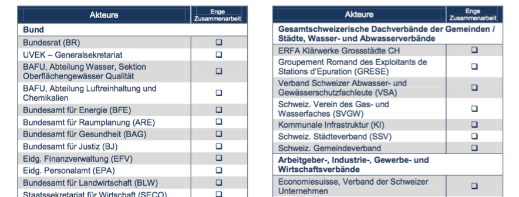
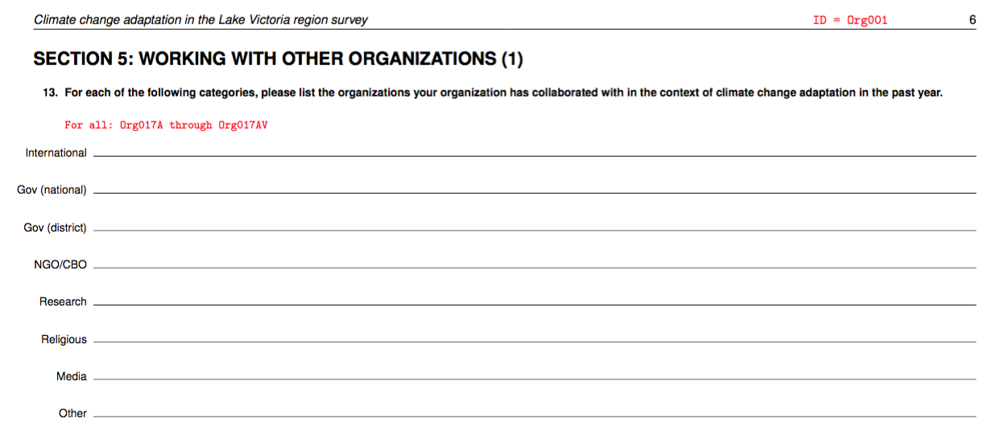
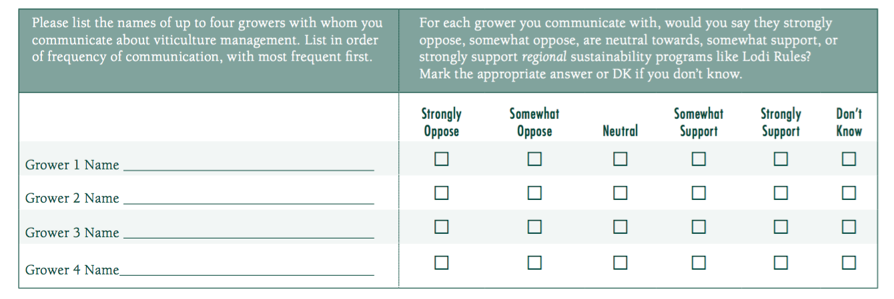
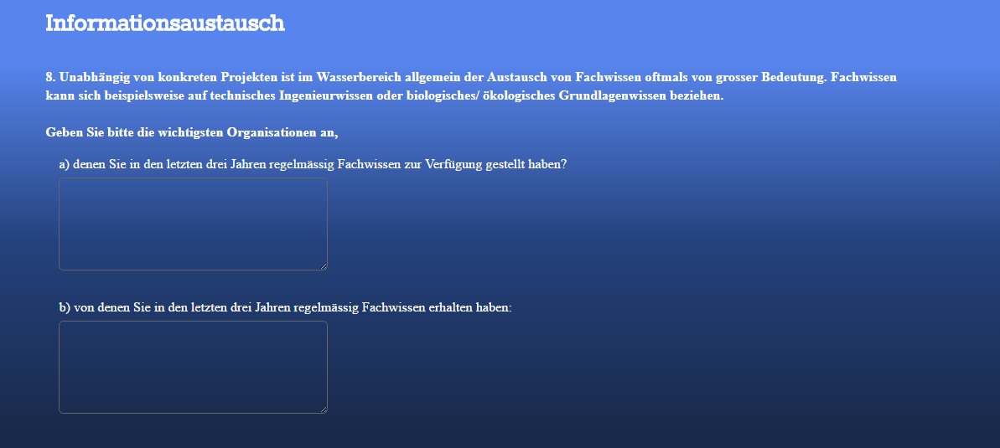

<!--  -->
<!-- <div class="notes"> -->
<!-- A comment -->
<!-- </div> -->

<!-- ## <span style="color:blue">Your turn</span> -->

# Gathering network data - overview

## No-Go's in gathering survey data

- Scenario: You're gathering network data among team members of the women's Swiss national Rugby team
- What are absolute no-go's? tabus? horror scenarios? that could happen to you in the field
```{r, echo=FALSE, fig.width=4, fig.height=2}
knitr::include_graphics(rep("slides_resources/rugbyteam.jpg"))
```

## Collecting network data

Network data can be collected in different manners
- Survey
- Observation
- data bases (online/offline)
- ...

## Collecting network data: Surveys
- face-to-face interviews; online surveys; paper-pen survey
- With whom have you worked in the past?
- Who are your friends?
- Please name a person that is of importance to you.
- Mit wem sind Sie befreundet?
- Welche Person ist besonders wichtig für XX?
- Mit wem stimmen Sie überein? mit wem nicht?
- Mit wem tauschen Sie XX aus?

## Examples: Collaboration partner in a policy network


Source: Metz, Florence, 2015: Do Policy Networks Matter to Explain Policy Design? PhD Thesis. University of Bern.

## Example: Collaboration partner in a policy network - through an interview


Source: Haden, Van R and Niles, Meredith T and Lubell, Mark and Perlman, Joshua and Jackson, Louise E, 2012: Global and local concerns: what attitudes and beliefs motivate farmers to mitigate and adapt to climate change? PloS One, 7(12):e52882.

## Example: Information exchange + attributes


Source: Hillis, Vicken and Lubell, Mark and Hoffman, Matthew, 2011: Winegrower perceptions of sustainability programs in Lodi, California. Project work. Center for Environmental Policy and Behavior, Davis, CA.

## Example: Information exchange


Source: Survey Overlapping Subsystems.

# Common problems in gathering network data

## Problem: Drawing network boundaries
- Who is in the network and who isn't?
- Are there clearly defined network boundaries?
- How do I know if I've surveyed all important/involved people?
- Is there someone I forgot?
- Do people outside the network have an effect on the network?

## Solution: Snowball Sampling
- If you're unsure if you've questioned all relevant people, do snowball sampling
- Idea: if someone named a person outside the sample, you question that person in a second round


Source: Robins, Garry, 2015: Doing social network research: Network-based research design for social scientists. Sage, Los Angeles.

## Problem: Response rates
- Network studies need a response rate of 80-100 percent
- Response rate: People who responded divided by people who were asked to fill out the survey

## How low response rates distort your analysis


Source: Costenbader, Elizabeth and Valente, Thomas W, 2003: The stability of centrality measures when networks are sampled. Social Networks, 25(4): 283-307.

## Solution: ??
- Sorry to disappoint
- Personal contact with respondents
- Asking for help (team leaders etc.)
- Be persistent but not disrespectful
- And if someone does not want to participate: respect that and move on

## Problem: Anonyminity?
- Network data cannot easily be anonymized
- ..this means that respondents may not want to tell you about their relationships
- ..especially if you ask sensitive questions
    - Which person is the least reliable in your team?
    - With whom have you had intimate relations in your team?
    - With whom do you exchange sensitive information?

## Solution: Grant Anonyminity!
- If your data stems from private sources: you'll need to anonymize them
- As soon as you've downloaded the data, change all names to ID-codes
- Instead of "Erica Schlegel" use "ID382"
- Create a key (with Names and IDcodes matching) - and keep it separate from your data set (and private of course)
- Anyone who analyzes your data cannot have access to this key
